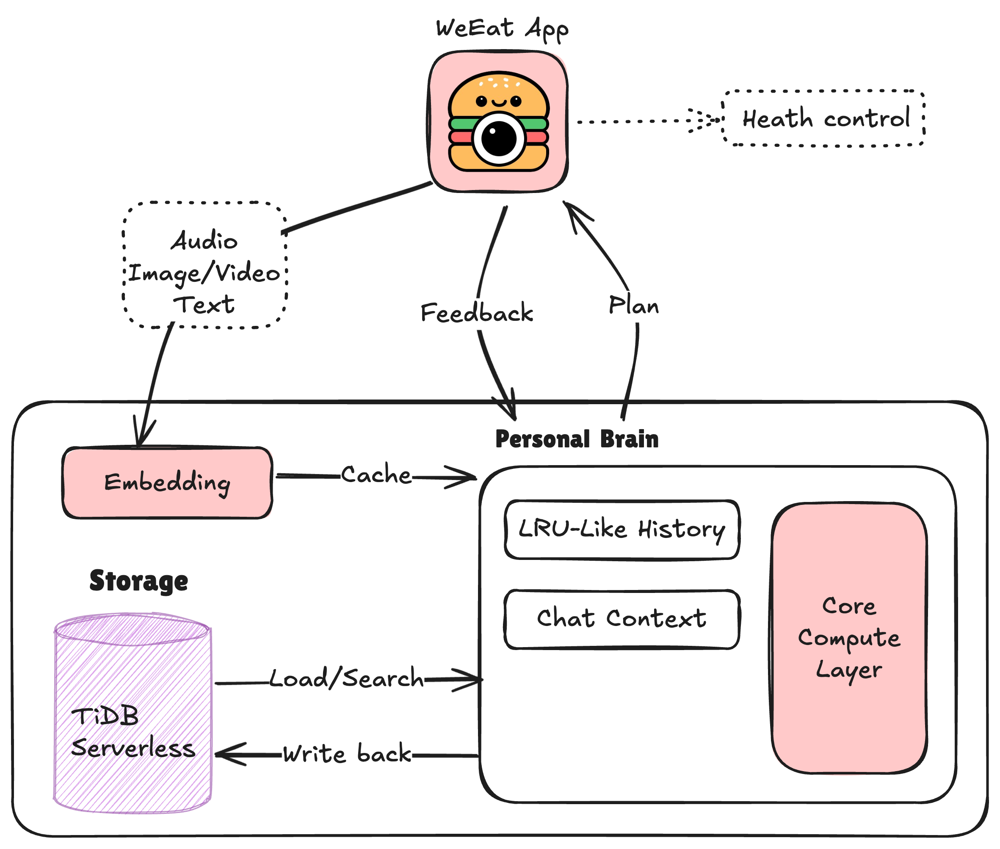

# WeEat AI

  

  <a href="https://weeat-ai.vercel.app/">WeEat</a>

The **memory-driven**(Memory cache + TiDB Vector Search) personalized health management app with private AI.

# Introduction

[WeEat](https://weeat-ai.vercel.app/) is an AI-powered personalized health management application that leverages private AI to deliver tailored health and dietary advice. WeEat tracks your health metrics, learns your preferences, and adapts over time to provide the most relevant recommendations.

  

### Core Features

- **Private AI**: All data processing is done for your own, ensuring your personal information remains secure.
- **Adaptive Learning**: The AI evolves with you, refining its suggestions as it learns more about your habits with Least Recently Used Mechanism, and knows your latest preferences, **not outdated ones.**
- **Personalized Diet Plans**: Tailored meal suggestions based on your custom data and preferences.
- **Real-Time Health Tracking**: Continuous monitoring and analysis of your health metrics.

### How WeEat Works

WeEat uses advanced AI LLM & **TiDB Serveless Vector Search** to analyze your health data, including dietary intake, activity levels, and biometric information. The system provides personalized recommendations designed to optimize your health and well-being. With real-time tracking, WeEat adjusts your diet and activity suggestions based on the latest data, helping you achieve your health goals.

### Use Cases

WeEat is designed for a wide range of users:

- **Health Enthusiasts**: Get tailored advice to optimize your diet and fitness routines.
- **Weight Management**: Track and achieve your weight goals with precision.
- **Athletes**: Enhance your performance with diet plans that cater to your specific training needs.
- **General Wellness**: Improve overall health with balanced, nutrient-rich meal suggestions.

# Get Started

Get started and install the WeEat via subpath:

- Backend: [weeat-backend](./weeat-backend/README.md)
- Frontend: [weeat-app](./weeat-app/README.md)

# Technologies Used

- **TiDB Serveless**: A cloud-native database that combines the best of SQL, with vector search capabilities.
- **vLLM**: About
A high-throughput and memory-efficient inference and serving engine for LLMs.
- **Llama3**: Better LLMs.
- **LlamaIndex**: LlamaIndex is a framework for building context-augmented generative AI applications with LLMs including agents and workflows.
- **YOLO**: YOLO (You Only Look Once) is a state-of-the-art, real-time object detection system.
- **Whisper**: Robust Speech Recognition via Large-Scale Weak Supervision.
- **BCEmbedding**: Bilingual and Crosslingual Embedding for RAG.